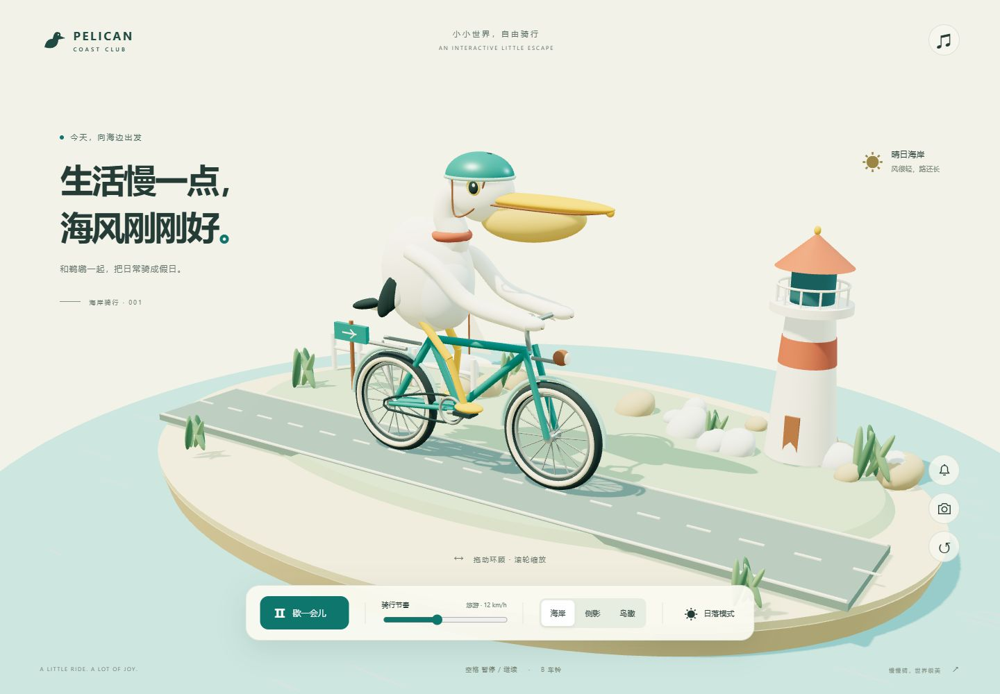

# Pelican Coast · 鹈鹕的海岸假日

一个可交互的 3D 海岸微缩世界：戴头盔的鹈鹕骑着自行车，伴随灯塔、帆船和海风。

**[在线体验 →](https://yongbinlan.github.io/pelican-coast/)**



## 体验

- 拖动旋转视角；滚轮或双指缩放。
- 骑行速度调节、暂停/继续，海岸/侧影/鸟瞰三个视角。
- 晴日与日落灯光切换。
- 点击播放合成车铃和海浪声；默认不播放声音。
- 保存当前 3D 画面为 PNG。
- 适配手机；尊重系统减少动态效果偏好。
- 快捷键：空格暂停/继续，B 车铃，R 重置视角。

## 本地运行

需要 Python 3 和支持 WebGL 2 的现代浏览器。在仓库根目录运行：

```sh
python -m http.server 8765 --bind 127.0.0.1
```

打开 `http://127.0.0.1:8765/`。Windows 也可以在仓库目录用 PowerShell 运行 `./Start.ps1`。

无需 npm install 或构建。ES Modules 需要 HTTP 服务，请勿直接以 file:// 打开。

## 静态托管

网页没有后端、数据库或密钥，Three.js 已随仓库保存，运行时不请求第三方 CDN。

### GitHub Pages

仓库 Settings → Pages → Deploy from a branch，选择 `main` 与根目录 `/`。`.nojekyll` 已包含。项目子路径下可使用相对路径正常加载资源。

免费 GitHub 账户的 Pages 需要公开仓库；私有仓库支持取决于账户方案。启用 Pages 会发布可访问的网页。

### Cloudflare Pages

连接此 GitHub 仓库，使用无框架预设，生产分支 `main`，构建命令 `exit 0`，输出目录为仓库根目录。也可把 `index.html`、`app.js`、`style.css` 和 `vendor/` 作为静态网站上传。部署后平台提供 HTTPS 地址与 CDN 分发，后续可绑定域名。

官方说明：[GitHub Pages](https://docs.github.com/en/pages/getting-started-with-github-pages/what-is-github-pages) · [Cloudflare 静态 HTML](https://developers.cloudflare.com/pages/framework-guides/deploy-anything/)

## 实现与验证

原生 HTML/CSS/JavaScript + Three.js 0.170.0。鹈鹕、自行车和环境均为程序化模型，没有外部图片模型依赖。车轮绕独立车轴旋转，脚掌随脚踏联动。角色在微缩舞台上原地骑行，道路标线移动表现前进；不是无限地图。速度数值用于控制动画节奏。

交付前已进行真实浏览器桌面和 320/360/390/430 CSS px 手机画面检查、主要交互、PNG 导出及减少动态效果检查。声音事件已执行，未做主观听音验收；尚未覆盖所有实际手机 GPU。

## 第三方依赖

`vendor/three.module.js` 与 `vendor/OrbitControls.js` 来自 npm 官方 `three@0.170.0` 包，遵循 MIT 许可证，详见 `vendor/LICENSE-three.txt`。该许可只说明第三方库，不自动扩大到本项目其他文件。

本应用代码没有遥测或上传功能；托管服务可能记录正常访问日志。
